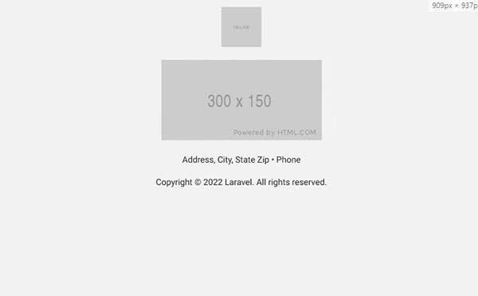

# Laravel Mail Components Library

A collection of pre-made simple Laravel Blade mail components.

## Installation & setup

You can install the package via composer:

    composer require bjnstnkvc/mail-components

The package will automatically register its service provider.

## Usage

### Config

Publish the components' config file with:

    php artisan vendor:publish --provider="Bjnstnkvc\MailComponents\MailComponentsServiceProvider" --tag=mail-config

This will publish a file called ```mail_components.php``` in your config-directory.

### Styles

Publish the components' css file with:

    php artisan vendor:publish --provider="Bjnstnkvc\MailComponents\MailComponentsServiceProvider" --tag=mail-styles

This will publish a `mail-components.css` to `resources/views/vendor/mail/html/themes` directory.

### Theme

If you like to render an email via [Markdown](https://laravel.com/docs/9.x/mail#markdown-mailables), you'll need to set
Mailable `theme` property to `mail-components`.

```php
/**
 * Create a new message instance.
 */
public function __construct()
{
    $this->theme = 'mail-components';
}
```

or set `theme` property to `mail-components` in your `config/mail.php` file:

```php
    'markdown' => [
        'theme' => 'mail-components',

        'paths' => [
            resource_path('views/vendor/mail'),
        ],
    ],
```

### Mail Components

In order to use the Mail components, use standard Blade Component syntax from
the [docs](https://laravel.com/docs/9.x/blade#rendering-components). By the default, the Mail
components can be used with the `mail` prefix.

#### Layout

Layout component is a base of every mail. Besides creating a boilerplate table that will hold mail content, it also
handles media queries for responsiveness.

List of all properties Layout component accepts is as follows:

| Property    | Description                                                                                                                                               |
|-------------|-----------------------------------------------------------------------------------------------------------------------------------------------------------|
| background  | Layout Background color (accepts all [color values](https://www.w3schools.com/cssref/css_colors_legal.asp)).                                              |
| title       | Layout title.                                                                                                                                             |
| font        | Layout font url.                                                                                                                                          |
| font-family | Layout font family                                                                                                                                        |
| is-markdown | Determine whether the email is Markdown formatted or not. If set to true, all classes except media queries from style tag will be omitted from the email. |

In order to render the component, use the following syntax:

```blade
<x-mail::layout>
    ...
</x-mail::layout>
```

If you'd like to add additional content to the `<head>` tag of the layout, use the following syntax:

```blade
<x-mail::layout>
    <x-slot:head>
        ...
    </x-slot>
</x-mail::layout>
```

#### Header

List of all properties Header component accepts is as follows:

| Property  | Description                                                       |
|-----------|-------------------------------------------------------------------|
| app-url   | Header logo app url (defaults to `APP_URL` property from `.env`). |
| logo      | Header logo (accepts image url or asset path as an argument).     |
| width     | Header logo width.                                                |
| height    | Header logo height.                                               |
| show-logo | Determine whether to show Header Logo (defaults to `true`).       |

In order to render the component, use the following syntax:

```blade
<x-mail::header />
```

If you'd like to add additional content to the header, use the following syntax:

```blade
<x-mail::header>
    ...
</x-mail::header>
```

#### Footer

List of all properties Footer component accepts is as follows:

| Property       | Description                                                             |
|----------------|-------------------------------------------------------------------------|
| email          | Footer Email address.                                                   |
| country        | Footer country.                                                         |
| state          | Footer state.                                                           |
| city           | Footer city.                                                            |
| address        | Footer street address.                                                  |
| zip            | Footer zip code.                                                        |
| phone          | Footer phone number.                                                    |
| show           | Determine whether to display the Footer (defaults to `true`).           |
| show-copyright | Determine whether to display the Footer copyright (defaults to `true`). |

In order to render the component, use the following syntax:

```blade
<x-mail::footer />
```

If you'd like to add additional content to the header, use the following syntax:

```blade
<x-mail::footer>
    ...
</x-mail::footer>
```

#### Content

Content component creates a boilerplate HTML structure suitable for any injected content outside of other Mail
components.

List of all properties Footer component accepts is as follows:

| Property   | Description               |
|------------|---------------------------|
| background | Content Background color. |

In order to render the component, use the following syntax:

```blade
<x-mail::content>
    ...
</x-mail::content>
```

#### Grid

Grid component creates a boilerplate HTML structure suitable for any injected 'grid-like' content. It can create up to 4
grid columns that are fully responsive.

List of all properties Grid component accepts is as follows:

| Property   | Description                                                  |
|------------|--------------------------------------------------------------|
| background | Grid Background color.                                       |
| columns    | Number of Grid Columns (defaults to `1`).                    |
| spacing    | Grid Grid spacing (options: `top`, `bottom`, `top, bottom`). |
| one        | Grid Column first Slot.                                      |
| two        | Grid Column second Slot.                                     |
| three      | Grid Column third Slot.                                      |
| four       | Grid Column fourth Slot.                                     |

In order to render a Grid component with different number of columns, simply add `columns` property to the component
followed by number of columns.

```blade
<x-mail::grid columns="2">
    ...
</x-mail::grid>
```

If your columns are containing simple text, you can pass them as a property as well using the following syntax:

```blade
<x-mail::grid columns="2" one="Lorem ipsum dolor sit amet..." two="Lorem ipsum dolor sit amet..." />
```


However, if you'd like to inject more complex HTML, use the
standard [Blade Slot syntax](https://laravel.com/docs/9.x/blade#slots):

```blade
<x-mail::grid columns="2">
    <x-slot:one>
        <h1>Column 1 Title</h1>
        <p>Column 1 paragraph</p>
    </x-slot>
    <x-slot:two>
        <h1>Column 2 Title</h1>
        <p>Column 2 paragraph</p>
    </x-slot>
</x-mail::grid>
```


#### Hero

Hero component creates a boilerplate HTML structure suitable for any injected 'hero-like' content.

List of all properties Hero component accepts is as follows:

| Property   | Description                             |
|------------|-----------------------------------------|
| background | Hero section background Image.          |
| height     | Hero section height (default is `400`). |
| title      | Hero section Title.                     |
| subtitle   | Hero section Subtitle.                  |
| button     | Hero section button.                    |
| button-url | Hero section button url.                |

In order to render a Hero component use the following syntax:

```blade
<x-mail::hero background="https://via.placeholder.com/1200x800" title="Hello" subtitle="How are you doing?" button="Answer" button-url="{{ route('answer') }}" />
```


However, if you'd like to inject more complex syntax, use the
standard [Blade Slot syntax](https://laravel.com/docs/9.x/blade#slots):

```blade
<x-mail::hero background="https://via.placeholder.com/1200x800">
    <x-slot:title>
        <h1>Title</h1>
    </x-slot>

    <x-slot:subtitle>
        <ol>
            <li>Item 1</li>
            <li>Item 2</li>
            <li>Item 3</li>
        </ol>
    </x-slot>

    <x-slot:button>
        <a class="button btn-black" href="#">Button</a>
    </x-slot>
</x-mail::hero>
```


#### Subcopy

List of all properties Subcopy component accepts is as follows:

| Property   | Description               |
|------------|---------------------------|
| background | Subcopy Background color. |

In order to render the component, use the following syntax:

```blade
<x-mail::subcopy>
    ...
</x-mail::subcopy>
```

#### Table

List of all properties Table component accepts is as follows:

| Property          | Description                                       |
|-------------------|---------------------------------------------------|
| background        | Table background color.                           |
| header-background | Table Header background color.                    |
| row-index         | Determine whether to show table row index column. |
| model             | Table Eloquent model.                             |
| columns           | Table headers.                                    |
| headers           | Table columns.                                    |

Table component comes with three ways in which you can populate the table with data:

###### String

```blade
<x-mail::table headers="First Name, Last Name, Email" columns="1:John|Doe|john.doe@example.com, 2:Jane|Doe|jane.doe@example.com" />
```

###### Array

```php
$headers = ['First Name', 'Last Name', 'Email'];
$columns = [
    ['John', 'Doe', 'john.doe@example.com'],
    ['Jane', 'Doe', 'jane.doe@example.com'],
];
```

```blade
<x-mail::table row-index="false" :headers="$headers" :columns="$columns" />
```

In both cases, following table would be generated:


###### Model

Let's say we have users table with the following data:

| id | first_name | last_name | email                | email_verified_at   | created_at          | updated_at          | role_id |
|----|------------|-----------|----------------------|---------------------|---------------------|---------------------|---------|
| 1  | John       | Doe       | john.doe@example.com | 2022-09-01 12:00:00 | 2022-09-30 22:00:00 | 2022-09-01 12:00:00 | 2       |
| 2  | Jane       | Doe       | jane.doe@example.com | 2022-09-01 10:00:00 | 2022-09-30 23:00:00 | 2022-09-01 12:00:00 | 3       |

passed from the controller:

```php
return view('welcome', [
    'users' => User::all();
]);
```

In order to use it with Table component, following syntax is used:

```blade
<x-form::table :model="$users" />
```

will generate following table:


Table generated with model will create a header for each property of the model. For example, if we'd pass following
data:

```php
return view('welcome', [
    'users' => User::get([
        'first_name', 
        'last_name', 
        'email', 
        'email_verified_at as verified_at'
    ]);
]);
```

to the same blade from the example above, we'll ge the following output:


Table component comes with an option to render the content with Row Index cell by adding `row-index` property and
setting it to `true`.

```blade
<x-form::table row-index="true" :model="$users" />
```

Component above will render following table:


#### Image

List of all properties Image component accepts is as follows:

| Property      | Description                                                           |
|---------------|-----------------------------------------------------------------------|
| src           | Image source.                                                         |
| alt           | Image Alternative text description.                                   |
| width         | Image width (defaults to `auto`).                                     |
| height        | Image height (defaults to `auto`).                                    |
| is-responsive | Determine whether the Image is Responsive (defaults to `false`).      |
| as-section    | Determine whether to display Image as a section (defaults to `true`). |

In order to render the component, use the following syntax:

```blade
<x-mail::image />
```

By default, rendered image will not take more than it's width, no matter the screen size. If you add `is-responsive`
property, and set it to `true`, image will take full screen width on smaller size screens.



Image component by default is rendered as a mail section, meaning `img` tag is wrapped
within [Mail Content component](#content) which will result in an image taking its own table row.

In case you'd like to include an image as a part of another component or simply render it as it is, add `is-section`
property and set it to `false`.

#### Button

List of all properties Button component accepts is as follows:

| Property | Description                         |
|----------|-------------------------------------|
| url      | Button link.                        |
| title    | Button title.                       |
| width    | Button width (defaults to `200`).   |
| height   | Button height (defaults to `40`).   |
| color    | Button color (defaults to `black`). |

In order to render the component, use the following syntax:

```blade
<x-mail::button />
```

If your Button is containing simple text/title, you can pass is as a property using the following syntax:

```blade
<x-mail::button title="Button"/>
```

However, if you'd like to inject more complex HTML, use the
standard [Blade Slot syntax](https://laravel.com/docs/9.x/blade#slots):

```blade
<x-mail::button>
    <h1>Button</h1>
</x-mail::button>
```

#### New Line

List of all properties New Line component accepts is as follows:

| Property   | Description                                                    |
|------------|----------------------------------------------------------------|
| height     | New Line Break height.                                         |
| asTable    | Determine whether the component should be rendered as a table. |
| background | New Line Break background color.                               |

In order to render the component, use the following syntax:

```blade
<x-mail::new-line />
```

## Examples

#### Verify Email

Let's say we want to create a Verification Email that gets sent when the user successfully registers.

First, we'll create a Mail class using following artisan command:

    php artisan make:mail VerificationMail

Command above will create a `VerificationMail.php` Mail class with the same name in `app\Mail` directory.

Next step would be to attach data that we'll use to the class.

```php
class VerificationMail extends Mailable
{
    /**
     * Create a new message instance.
     */
    public function __construct(public User $user, public string $email, public string $token)
    {
        // 
    }
    
    /**
     * Get the message envelope.
     */
    public function envelope(): Envelope
    {
        return new Envelope(
            from   : new Address('example@example.com', 'Example'),
            subject: 'Verify Email',
        );
    }

    /**
     * Get the message content definition.
     */
    public function content(): Content
    {
        return new Content(
            view: 'mail.verification-mail',
        );
    }
}
```

Next step would be to create a [view](https://laravel.com/docs/9.x/mail#configuring-the-view). For this example, we'll
create `verify-email.blade.php` file in `resources/views/emails` directory.

Finally, we'll use Mail Components to create an HTML for aforementioned email.

Let's start with creating our basic Layout with Header and Footer. Blade syntax below:

```blade
<x-mail::layout title="Verify Email">
    <x-mail::header />
    
    <x-mail::footer />
</x-mail::layout>
```

will render following HTML:


Next, we'll add email content:

```blade
<x-mail::layout title="Verify Email">
    <x-mail::header />
    
    <x-mail::content background="#FFFFFF">
        <h1>Hello, {{ $user->first_name }}!</h1>
        <br>
        <p>Please click the button below to verify your email address.</p>
        <br>
        <x-mail::button url="{{ route('verify.email', ['user' => $user, 'token' => $token]) }}">Verify Email Address</x-mail::button>
        <br>
        <p>If you did not create an account, no further action is required.</p>
    </x-mail::content>
    
    <x-mail::footer />
</x-mail::layout>
```

which will generate following HTML:


We'll add a Subcopy with verification link as a string in case the user has trouble verifying an email via button.

```blade
<x-mail::layout title="Verify Email">
    <x-mail::header />
    
    <x-mail::content background="#FFFFFF">
        <h1>Hello, User!</h1>
        <br>
        <p>Please click the button below to verify your email address.</p>
        <br>
        <x-mail::button url="{{ route('verify.email', ['user' => $user, 'token' => $token]) }}">Verify Email Address</x-mail::button>
        <br>
        <p>If you did not create an account, no further action is required.</p>
    </x-mail::content>
    
    <x-mail::subcopy>
        If you're having trouble clicking the "Verify Email Address" button, copy and paste the URL below into your web browser:
        <strong>{{ route('verify.email', ['user' => $user, 'token' => $token]) }}</strong>
    </x-mail::subcopy>
    
    <x-mail::footer />
</x-mail::layout>
```

now, our email looks as follows:


## Customisation

### Config

- **prefix** - *Mail Components prefix, defaults to 'mail' (E.g. <x-mail-button>).*


- **separator** - *Mail Components separator, defaults to '::' (E.g. <x-mail::button>).*


- **layout** - *Array containing Mail Components Layout settings.*
    - **font_link** - *Font link that the Mail Components will use. (
      E.g. https://fonts.googleapis.com/css2?family=Roboto&display=swap).*
    - **font_family** - *Font family name (E.g. Roboto).*
    - **background** - *Layout Component background color.*


- **header** - *Array containing Mail Components Header settings.*
    - **show** - *Determines whether the Header Mail Component will be visible (defaults to `true`).*
    - **logo** - *Header logo (url or path to the asset).*
    - **width** - *Header logo width (if none passed, it'll take logo image width).*
    - **height** - *Header logo height (if none passed, it'll take logo image width).*


- **footer** - *Array containing Mail Components Footer settings.*
    - **show** - *Determines whether the Footer Mail Component will be visible (defaults to `true`).*
    - **show_copyright** - *Determines whether the Footer Mail Component copyright line will be visible (defaults
      to `true`).*
    - **address** - *Street address of your business.*
    - **city** - *City of your business.*
    - **state** - *State of your business.*
    - **zip** - *Zip code of your business.*
    - **phone** - *Phone number of your business.*


- **content** - *Array containing Mail Components Content settings.*
    - **background** - *Content Component background color.*


- **grid** - *Array containing Mail Components Grid settings.*
    - **background** - *Grid Component background color.*
    - **spacing** - *Renders spacing between Grid and other components (
      options: `none`, `top`, `bottom`, `top, bottom`).*


- **hero** - *Array containing Mail Components Hero settings.*
    - **background** - *Hero Component background color.*
    - **height** - *Hero Component height.*


- **subcopy** - *Array containing Mail Components Subcopy settings.*
    - **background** - *Subcopy Component background color.*


- **table** - *Array containing Mail Components Table settings.*
    - **row_index** - *Determines whether the Table component will be rendered with Row index column.*
    - **background** - *Table Component background color.*
    - **header_background** - *Table Component header background color.*


- **image** - *Array containing Mail Components Image settings.*
    - **is_responsive** - *Determines whether the Image component will be responsive.*
    - **as_section** - *Determines whether the Image component will be rendered as a section or as plain image.*


- **button** - *Array containing Mail Components Button settings.*
    - **width** - *Button width (defaults to `200`).*
    - **height** - *Button height (defaults to `40`).*
    - **color** - *Button color (defaults to `black`).*


- **new_line** - *Array containing Mail Components New Line settings.*
    - **height** - *New Line height (defaults to `16`).*
    - **as_table** - *Determine whether the component should be rendered as a table (defaults to `false`).*
    - **background** - *New Line background color*

> **Note:** You might need to clear config cache using `php artisan cache:clear` command after you make changes
> to `.env` file.

### Publishing

You can publish all components class and view using artisan the following command:

    php artisan components:publish

Optionally, you can pass component name as an argument, which will publish only those components.

    php artisan components:publish Header Footer Table

From this point on, you can change the published component class and view to your liking.

### Restoring

If by any chance you'd like to restore the components default settings, use the following artisan command:

    php artisan components:restore

Optionally, you can pass component name as an argument, which will restore only those components.

    php artisan components:restore Header Footer Table

Additionally, if you'd like to remove previously published components class and views, you can attach `--delete` option:

    php artisan components:restore --delete

or

    php artisan components:restore Header Footer Table --delete

> **Note:** You might need to clear config cache using `php artisan cache:clear` command after you publish or restore
> the components.

## License

The MIT License (MIT). Please see [License File](LICENSE) for more information.
